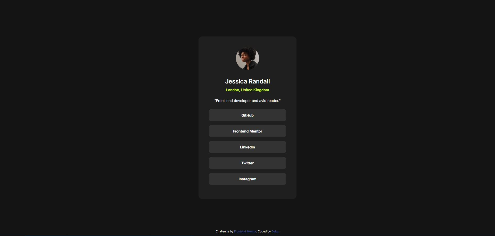

# Frontend Mentor - Social links profile solution

This is a solution to the [Social links profile challenge on Frontend Mentor](https://www.frontendmentor.io/challenges/social-links-profile-UG32l9m6dQ). Frontend Mentor challenges help you improve your coding skills by building realistic projects. 

## Table of contents

- [Overview](#overview)
  - [The challenge](#the-challenge)
  - [Screenshot](#screenshot)
  - [Links](#links)
- [My process](#my-process)
  - [Built with](#built-with)
  - [What I learned](#what-i-learned)
- [Author](#author)

## Overview

### The challenge

Users should be able to:

- See hover and focus states for all interactive elements on the page

### Screenshot



### Links

- Solution URL: [Solution](https://github.com/Dekujke/Practice/tree/main/Frontend%20Mentor%20projects/03.%20Social%20links%20profile)
- Live Site URL: [Site](https://dekujke.github.io/Projects/Frontend%20Mentor/03.%20Social%20links%20profile/index.html)

## My process

### Built with

- Semantic HTML5 markup
- CSS custom properties
- Flexbox

### What I learned

I learned how to change component when it's focused.

```css
.social-media-link:focus {
    background-color: var(--hover);
    color: var(--background);
}
```

## Author

- GitHub - [Deku-](https://github.com/Dekujke)
- Frontend Mentor - [@Dekujke](https://www.frontendmentor.io/profile/Dekujke)
