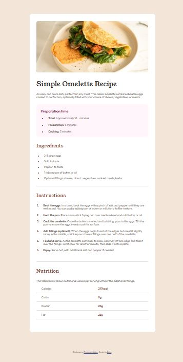

# Frontend Mentor - Recipe page solution

This is a solution to the [Recipe page challenge on Frontend Mentor](https://www.frontendmentor.io/challenges/recipe-page-KiTsR8QQKm). Frontend Mentor challenges help you improve your coding skills by building realistic projects. 

## Table of contents

- [Overview](#overview)
  - [Screenshot](#screenshot)
  - [Links](#links)
- [My process](#my-process)
  - [Built with](#built-with)
  - [What I learned](#what-i-learned)
- [Author](#author)

## Overview

### Screenshot



### Links

- Solution URL: [Solution](https://github.com/Dekujke/Practice/tree/main/Frontend%20Mentor%20projects/04.%20Recipe%20page)
- Live Site URL: [Site](https://dekujke.github.io/Projects/Frontend%20Mentor/04.%20Recipe%20page/index.html)

## My process

### Built with

- Semantic HTML5 markup
- CSS custom properties
- Flexbox

### What I learned

I learned how to style list markerks

```css
.preparation-item::marker {
    color: var(--prep-header);
    font-weight: 600;
}
```

## Author

- GitHub - [Deku-](https://github.com/Dekujke)
- Frontend Mentor - [@Dekujke](https://www.frontendmentor.io/profile/Dekujke)