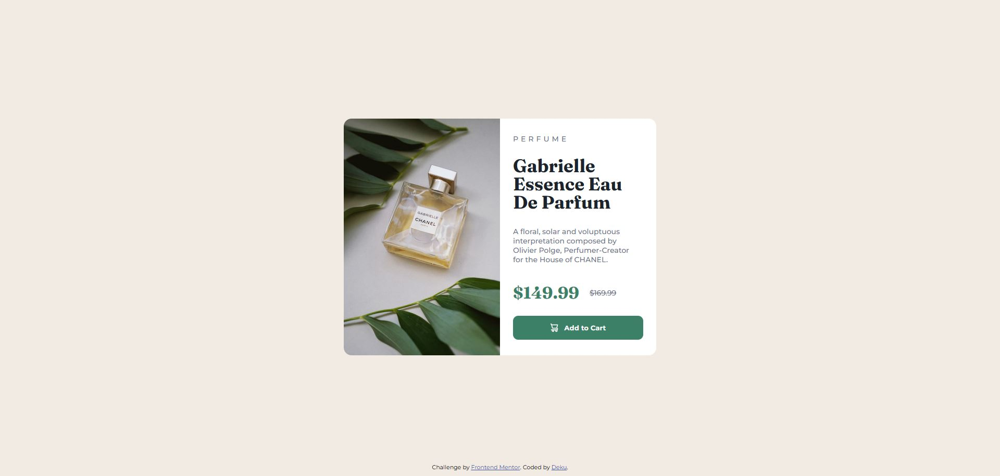

# Frontend Mentor - Product preview card component solution

This is a solution to the [Product preview card component challenge on Frontend Mentor](https://www.frontendmentor.io/challenges/product-preview-card-component-GO7UmttRfa). Frontend Mentor challenges help you improve your coding skills by building realistic projects. 

## Table of contents

- [Overview](#overview)
  - [The challenge](#the-challenge)
  - [Screenshot](#screenshot)
  - [Links](#links)
- [My process](#my-process)
  - [Built with](#built-with)
  - [What I learned](#what-i-learned)
- [Author](#author)

## Overview

### The challenge

Users should be able to:

- View the optimal layout depending on their device's screen size
- See hover and focus states for interactive elements

### Screenshot

### Links

- Solution URL: [Solution](https://github.com/Dekujke/Practice/tree/main/Frontend%20Mentor%20projects/05.%20Product%20preview%20card%20component)
- Live Site URL: [Site](https://dekujke.github.io/Projects/Frontend%20Mentor/05.%20Product%20preview%20card%20component/index.html)

## My process

### Built with

- Semantic HTML5 markup
- CSS custom properties
- Flexbox

### What I learned

I learned how to use different images for various device's screen size

## Author

- GitHub - [Deku-](https://github.com/Dekujke)
- Frontend Mentor - [@Dekujke](https://www.frontendmentor.io/profile/Dekujke)