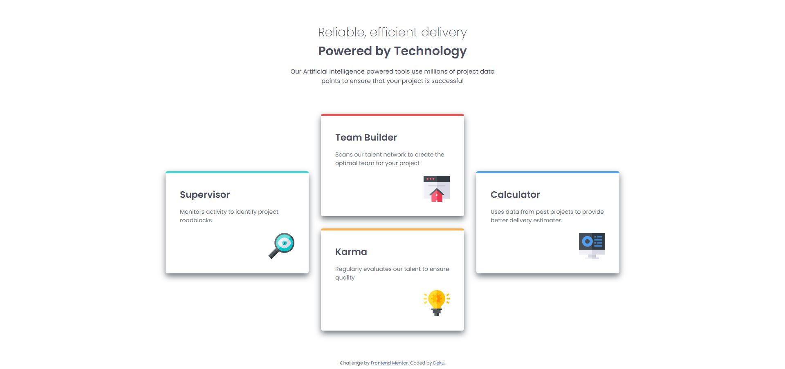

# Frontend Mentor - Four card feature section solution

This is a solution to the [Four card feature section challenge on Frontend Mentor](https://www.frontendmentor.io/challenges/four-card-feature-section-weK1eFYK). Frontend Mentor challenges help you improve your coding skills by building realistic projects. 

## Table of contents

- [Overview](#overview)
  - [The challenge](#the-challenge)
  - [Screenshot](#screenshot)
  - [Links](#links)
- [My process](#my-process)
  - [Built with](#built-with)
  - [What I learned](#what-i-learned)
- [Author](#author)

## Overview

### The challenge

Users should be able to:

- View the optimal layout for the site depending on their device's screen size

### Screenshot



### Links

- Solution URL: [Solution](https://github.com/Dekujke/Practice/tree/main/Frontend%20Mentor%20projects/06.%20Four%20card%20feature%20section)
- Live Site URL: [Site](https://dekujke.github.io/Projects/Frontend%20Mentor/06.%20Four%20card%20feature%20section/index.html)

## My process

### Built with

- Semantic HTML5 markup
- CSS custom properties
- Flexbox
- CSS Grid

### What I learned

I learned how to use CSS Grid Layout

```css
.grid-container {
    grid-template-columns: repeat(3, 1fr);
    gap: 30px;
}

.item1 {
    grid-column: 1 / span 1;
    grid-row: 1 / span 2;
    align-self: center;
}

.item2 {
    grid-column: 2 / span 1;
    grid-row: 1 / span 1;
}

.item3 {
    grid-column: 2 / span 1;
    grid-row: 2 / span 1;
}

.item4 {
    grid-column: 3 / span 1;
    grid-row: 1 / span 2;
    align-self: center;
}
```

## Author

- GitHub - [Deku-](https://github.com/Dekujke)
- Frontend Mentor - [@Dekujke](https://www.frontendmentor.io/profile/Dekujke)